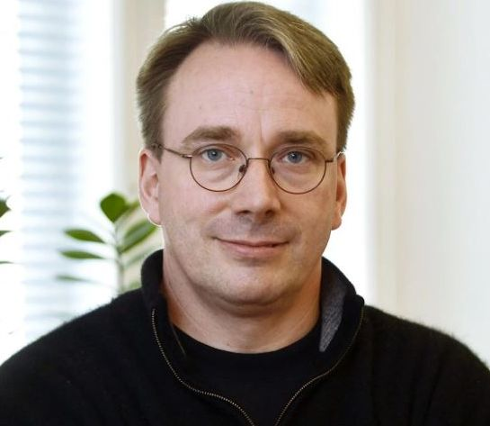

\begin{center}
\textbf{Gimanzija „Jovan Jovanović Zmaj“}
\\
Novi Sad
\end{center}
\vfill
\begin{center}
	\begin{large}
		\textbf{Maturski rad iz Operativnih Sistema}
		\bigskip 
	\end{large}
	\\
	\begin{huge}
        \textbf{Operativni sistem Linux}
	\end{huge}
\end{center}
\vfill
\begin{normalsize}
Profesor mentor:
\hfill
Učenik:
\\
Saša Tošić
\hfill
Aleksa Siriški IV-6
\end{normalsize}
\vfill
\begin{center}
Novi Sad, maj 2022. god.
\end{center}
\pagebreak

# Sadržaj
1. [Predgovor]
2. [Uvod]
3. [Komponente]
4. [Komande]
5. [Hijerarhija sistema datoteka]
6. [Radna površina]
7. [Zaključak]
8. [Literatura]
\pagebreak

# Predgovor

Za ovu temu sam se opredelio iz više razloga. Prvenstveno zbog ljubavi prema informacionim tehnologijama, koju sam stekao zahvaljujući mojim roditeljima. Drugi razlog je to što smatram da je ovo veoma fascinantna tema, jer obuhvata kompleksnost koje se moze postići kada na jednom projektu radi čitav svet. Na kraju, ono što me je privuklo da izaberem baš ovu temu, jeste činjenica da je budućnost IT-a slobodan i besplatan kod.

U ovom radu, analiziraću osnovne komponente jednog izuzetnog operativnog sistema, istoriju njegove kreacije kao i filozofski pogled na isti.

\pagebreak

# Uvod

Unix su stvorili i objavili Ken Thompson i Dennis Ritchie 1970. godine. Kasnije je prekucan u C programskom jeziku i time postao veoma fleksibilan i izmenljiv. Razni fakulteti i univerziteti su pravili svoje verzije Unixa, npr. BSD koji je nalik Linuxa i dan danas u upotrebi.

Richard Matthew Stallman, osnivač GNU projekta, je uz svoj tim započeo izradu kompletnog operativnog sistema čija je glavna namena da bude otvorena i slobodna alternativa za Unix. Jedina stvar koja je falila jeste kernel, sto je jezgro operativnog sistema koje služi da poveže sve druge komponente u zajednicu.

Linus Torvalds koji je bio iznerviran nedostatkom kernela za potpuno slobodan i otvoren operativni sistem odlučuje da napiše svoj sopstveni. Već je bio upućen u Minix i GNU softver te je tokom studija u Finskoj započeo projekat nazvan "Linux". U početku je jedini radio na njemu, ali do danas se priključilo preko 15000 programera u kreiranju kernela koji se sastoji iz vise od 17 miliona linija koda.

\pagebreak

# Komponente
\pagebreak

# Komande
\pagebreak

# Hijerarhija sistema datoteka
\pagebreak

# Radna površina
\pagebreak

# Zaključak
\pagebreak

# Literatura